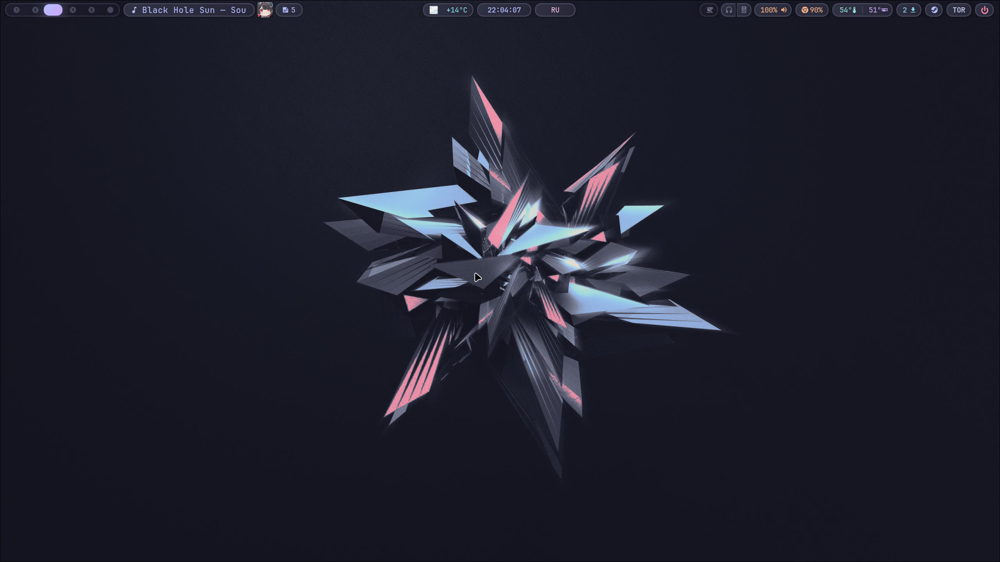
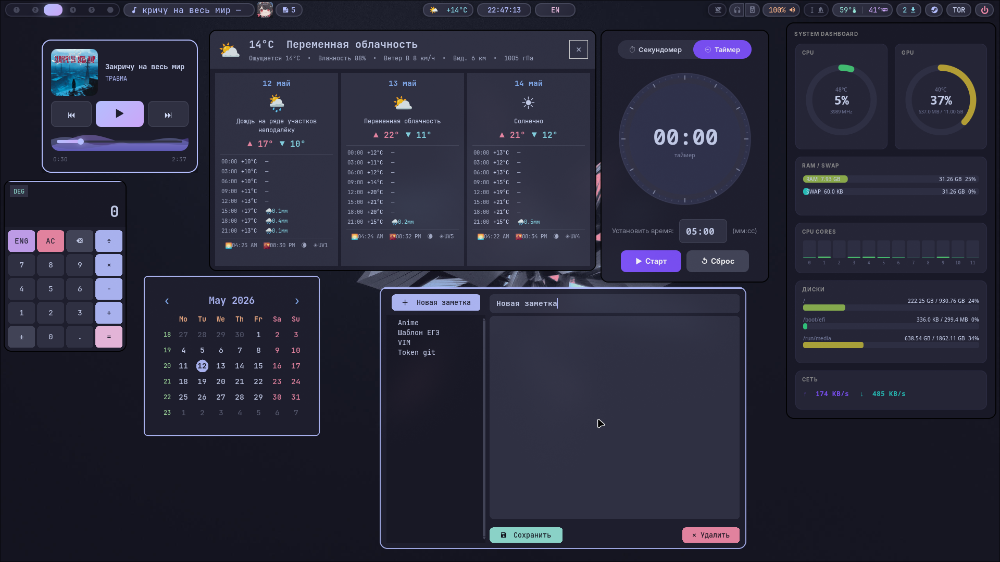

# Dotfile-save 

## Про конфиг
Это мои личные dotfiles под Hyprland.  
Конфиг сильно заточен под моё железо — часть биндов и скриптов может не работать у вас.  
Берите для вдохновения, не для прямого копирования.

## Что внутри
- **Hyprland** — оконный менеджер
- **Waybar** — панель сверху
- **Kitty** — терминал
- **Fish** — шелл
- **Rofi** — лаунчер
- **Swaync** — уведомления
- **Cava** — визуализатор звука
- **Matugen** — генерация цветовой схемы
- **Python, bash scripts** — личные скрипты по большей части вайбкод являются показаными на 2 скрине выпадающими модулями активация в основном в waybar (часть скриптов - эксперементы и они вообще не используются) 
## Дистрибутив
CachyOS
